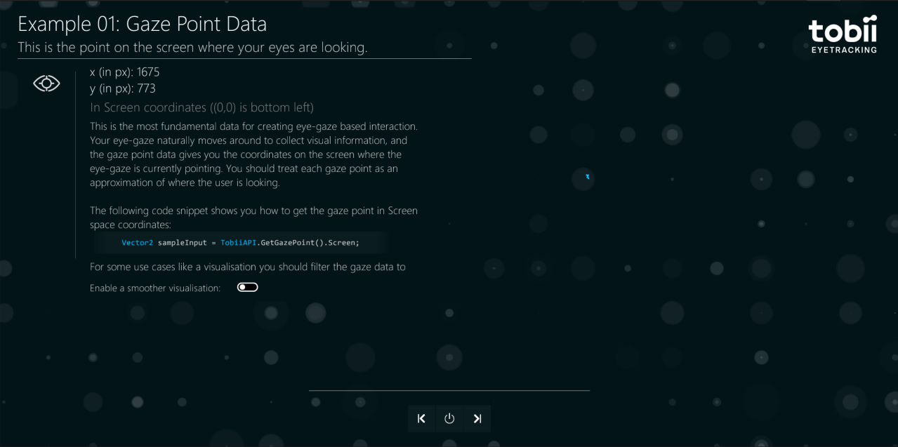
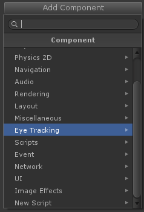
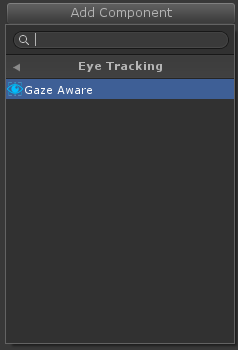
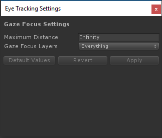
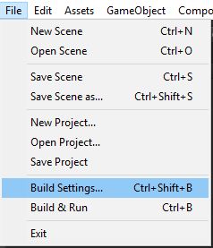
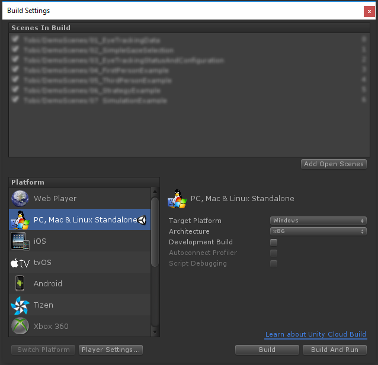
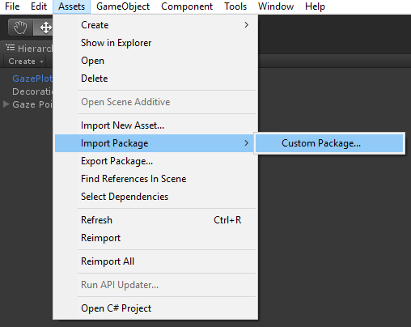

# User Manual

>*SDK version: 3.0 Beta*


## Good Choice :)

Thanks for choosing Tobii! You have invested your money and curiosity in an eye tracker device, let me now guide you through the steps to set you up to develop a whole new kind of game interactions using the player's eye-gaze.


## Contents

- [Getting Started](#getting-started)
- [Integrate the SDK into your game](#integrate-the-sdk-into-your-game)
  - [Import the assets](#import-the-assets)
  - [Implement eye tracking features](#implement-eye-tracking-features)
  - [Build for standalone](#build-for-standalone)
- [API Overview](#api-overview)
  - [TobiiAPI](#tobiiapi)
  - [Gaze Point Data](#gaze-point-data)
  - [Head Pose Data](#head-pose-data)
  - [User Presence](#user-presence)
  - [Gaze Focus and GazeAware component](#gaze-focus-and-gazeaware-component)
- [System Requirements](#system-requirements)
- [Appendix: Unity Editor Howto's](#appendix-unity-editor-howtos)


## Getting Started

Follow these steps to get started exploring the demo scenes included in the SDK.

### Step 1: Install and make sure your eye tracker is working

>*For peripheral eye trackers only*


Make sure your system fulfills the [System Requirements](#system-requirements).

Follow the instructions included with your eye tracker to download and install the correct Tobii Engine runtime software. Make sure the eye tracker and software is working correctly.

### Step 2: Download the Tobii Unity SDK for Desktop

If you haven't already done so, download the Tobii Unity SDK for Desktop from [Tobii Developer Zone (http://developer.tobii.com)](http://developer.tobii.com). You need to be logged in to access the Downloads page. You can create an account for free, it only takes a couple of minutes.


### Step 3: Import the SDK assets to a new Unity project

Save the Tobii Unity SDK for Desktop unitypackage file in an easy to remember place on disk. This unitypackage includes all the Tobii Unity SDK assets and demo scenes.

Open Unity, and create a New Unity Project. Select [Windows as Target Platform](#set-windows-as-target-platform).

[Import all assets](#import-the-sdk-assets) from the Tobii Unity SDK for Desktop unitypackage.


### Step 4: Get to know the API and the eye-gaze data

Locate the `Assets/Tobii` folder in the Unity Editor Project panel. Expand it and find the `DemoScenes` folder. Open the `01_EyeTrackingData` scene.

Add all the demo scenes to the build using `Tools` &rarr; `Add Tobii SDK Demo Scenes to Build` menu.

Press the play button and use the scenes' next button to go through the provided demo scenes and get an overview of the core features of the SDK and popular eye tracking features in games. See also [API Overview](#api-overview).



[&uarr; Back to Top](#user-manual)


## Integrate the SDK into your game

When you have explored the features of the SDK, it is time to try it out in your game. If at any point things don't work as expected, check out the [Troubleshooting](troubleshooting) page.

Section contents:

- [Import the assets](#import-the-assets)
- [Implement eye tracking features](#implement-eye-tracking-features)
  - [Drag and drop eye tracking features to your game](#drag-and-drop-eye-tracking-features-to-your-game)
  - [Make game objects Gaze Aware](#make-game-objects-gaze-aware)
- [Build for standalone](#build-for-standalone)

### Import the assets

Make sure Windows is the selected Target Platform in the build settings. Import the Tobii Unity SDK for Desktop unitypackage to your game (the `DemoScenes` folder is optional).


### Implement eye tracking features

To start using the TobiiAPI, add `using Tobii.Gaming;` to a script, type "[`TobiiAPI.`](scripting-api#tobiiapi)" and browse the static functions of the API:


You might also want to explore the possibilities of the the built-in object selection using eye-gaze by adding the Gaze Aware component to some of your game objects. The following sections give some hints what to explore.


[&uarr; Back to Section start](#integrate-the-sdk-into-your-game) | [&uarr; Back to Top](#user-manual)


#### Drag and drop eye tracking features to your game

You get the latest Gaze Point by calling [TobiiAPI.GetGazePoint()](scripting-api#tobiiapigetgazepoint) from any script where you have added `using Tobii.Gaming;` at the top of the script.

In the Tobii Gaming Team, we have implemented and helped implement eye tracking features in a number of games (from AAA titles to indie games) using this basic Gaze Point data. Over the years we have made a number of iterations and improvements to the algorithms. And now, for your convenience, we are making all our best algorithms freely available for you to use in your game (as long as they are used with Tobii eye trackers). Just drag, drop, and setup/adapt to fit your game. This is probably the fastest way you can add Tobii Eye Tracking features to your game.

Here is a list of features up for grab, and their scripts are all available in the DemoScenes folder of the SDK:

- [Extended View](eyetracking-features#extended-view) rotates the camera when you look towards the edges of the screen
- [Clean UI](eyetracking-features#clean-ui) makes UI elements semi-transparent if you don't look at them
- [Aim at Gaze](eyetracking-features#aim-at-gaze) aims your gun at the gaze point when you press an aim button
- [Interact at Gaze](eyetracking-features#interact-at-gaze) lets you interact directly with what you are looking at
- [Map Navigation](eyetracking-features#map-navigation) pans to or zooms where you are looking at the press of a button
- [Dynamic Light Adaptation](eyetracking-features#dynamic-light-adaptation) adjusts scene light exposure depending on your gaze point


[&uarr; Back to Section start](#integrate-the-sdk-into-your-game) | [&uarr; Back to Top](#user-manual)


#### Make game objects Gaze Aware

The SDK also comes with basic built-in gaze to object mapping. This enables eye tracking features like:

- [Interact at Gaze](eyetracking-features#interact-at-gaze) with the press of a button - interact directly with the object you are looking at
- [Gaze Awareness](eyetracking-features#gaze-awareness) lets your game react to the user's intentions by following their eye-gaze and attention

You can make a game object Gaze Aware by adding the Gaze Aware component in the Inspector:
`Add Component` &rarr; `Eye Tracking` &rarr; `Gaze Aware`.

  

The component's `HasGazeFocus` property lets the object know if the user's eye-gaze is focused on the object or not. Read the `HasGazeFocus` property in the Update loop of a Gaze Aware game object and have it react to the user's eye-gaze by changing its behavior or appearance. Or, let your underlying game algorithms query which game object the user is looking at using [TobiiAPI.GetFocusedObject()](scripting-api#tobiiapigetfocusedobject), and have the game respond to the user's eye-gaze in some other way.

```csharp
// Example script on Gaze Aware object:
// Make object spin when looked at!

using Tobii.Gaming;
using UnityEngine;
 
[RequireComponent(typeof(GazeAware))]
public class SpinOnGaze : MonoBehaviour
{
    private GazeAware _gazeAware;
 
    void Start()
    {
        _gazeAware = GetComponent<GazeAware>();
    }
 
    void Update()
    {
        if (_gazeAware.HasGazeFocus)
        {
            transform.Rotate(Vector3.forward);
        }
    }
}
```

Note that Gaze Aware objects might not be a good fit for your particular game genre, game mechanics, or size and amount of game objects. But it is usually at least a very convenient way of prototyping object interaction ideas.


##### Configure Gaze Focus layers for Gaze Aware objects

If you use the Gaze Aware component, you should set up the Gaze Focus detection layers. By default, the first time you press 'Play' in a game that uses some Tobii Unity SDK feature, default settings for Gaze Focus are created. The default settings selects all existing  layers to be tested for Gaze Aware objects. If a new layer is added to the game at a later point, and you want it to be tested for Gaze Aware objects, the layer has to be manually checked in the Gaze Focus layers dropdown menu. (Note that UI elements like buttons and labels do not work with the Gaze Aware component since the feature only works with objects with a `UnityEngine.Collider`).

Open the Eye Tracking Settings window from the Edit menu:
`Edit` &rarr; `Eye Tracking Settings...`

 

Click to open the Gaze Focus Layers multi-selection dropdown and make sure that all the layers are selected where you want Gaze Aware game objects to be focusable using eye-gaze. Also make sure that layers you do not want to track with eye-gaze are not selected (like transparent layers).


[&uarr; Back to Section start](#integrate-the-sdk-into-your-game) | [&uarr; Back to Top](#user-manual)


### Build for standalone

The Tobii Unity SDK assets include an editor script for copying the correct plugin dll's to the build output folder. The Tobii Unity SDK features are currently only available and working for PC (Windows 10/8.1/7), but the framework compiles on Mac and Linux as well (without copying the dll's).


[&uarr; Back to Section start](#integrate-the-sdk-into-your-game) | [&uarr; Back to Top](#user-manual)


## API Overview

It might be tempting to skip this part of the documentation, but I promise you that it will save you time later to at least browse through it.

This section gives an overview of the features available in the Tobii Unity SDK. It introduces the core concepts and gives you insight into what tools and features the SDK has to offer you, and how they work.

For API details on each class and function, see the Tobii Unity SDK [Scripting Reference](scripting-api).

Section contents:

- [TobiiAPI](#tobiiapi)
  - [Check validity on all data points](#check-validity-on-all-data-points)
- [Gaze Point data](#gaze-point-data)
- [Head Pose data](#head-pose-data)
- [User Presence](#user-presence)
- [Gaze Focus and GazeAware component](#gaze-focus-and-gazeaware-component)


### TobiiAPI

The static functions of the [TobiiAPI](scripting-api#tobiiapi) class is the essential API of the Tobii Unity SDK.

Include the line

```csharp
using Tobii.Gaming;
```

in a script anywhere in your game and you will have access to the static API functions.

Here are some of the API functions:

- [TobiiAPI.GetGazePoint()](scripting-api#tobiiapigetgazepoint)
- [TobiiAPI.GetHeadPose()](scripting-api#tobiiapigetheadpose)
- [TobiiAPI.GetUserPresence()](scripting-api#tobiiapigetuserpresence)
- [TobiiAPI.GetFocusedObject()](scripting-api#tobiiapigetfocusedobject)

You can read more about gaze point data, head pose data, user presence, and focused object in the sections below.


#### Check validity on all data points

The TobiiAPI is implemented using so called 'lazy initialization'. This means that the API is not initialized until the first call to any of its functions. Because of this, the first time the functions are called they will return values that are invalid (`IsValid` is `false`). Depending on how many game loops it takes to initialize the underlying framework, there will be a number of frames where invalid data is returned.

Gaze Point data and Head Pose data can be explicitly initialized by calling [TobiiAPI.SubscribeGazePointData](scripting-api#tobiiapisubscribegazepointdata) or [TobiiAPI.SubscribeHeadPoseData](scripting-api#tobiiapisubscribeheadposedata) respectively. If these functions are called during some appropriate time, during game startup for example, valid data can be available on the first calls to [TobiiAPI.GetGazePoint()](scripting-api#tobiiapigetgazepoint) and [TobiiAPI.GetHeadPose()](scripting-api#tobiiapigetheadpose).

In most cases it's also very important to know that you are working with recent data. [TobiiAPI.GetGazePoint()](scripting-api#tobiiapigetgazepoint) and [TobiiAPI.GetHeadPose()](scripting-api#tobiiapigetheadpose) will return the latest data received from the eye tracker but that can be old. For example, if a user looks away from the monitor. We suggest using `IsRecent()` method to ensure that data is both valid and recent.


[&uarr; Back to Section start](#api-overview) | [&uarr; Back to Top](#user-manual)


### Gaze Point data

[GazePoint](scripting-api#gazepoint) is the data type returned by [TobiiAPI.GetGazePoint()](scripting-api#tobiiapigetgazepoint). It represents the point on the screen where the user is looking. More technically it is the point on the screen where the eye tracker has calculated that a line along the user's eye-gaze intersects with the screen plane.


`GazePoint.Viewport` returns the gaze point in Viewport coordinates, where (0,0) is the bottom-left and (1,1) is the top-right corner of the `UnityEngine.Screen`. The values can be higher than 1 and lower than 0 if the user looks a bit outside the physical bounds of the monitor.

`GazePoint.Screen` returns a `Vector2` (x,y) coordinate on the `UnityEngine.Screen`. This might seem pretty much like getting a mouse pointer coordinate, but please do not make the mistake of using this point out-of-the-box as you would use a mouse pointer coordinate. Eye tracking data is not as precise as mouse pointer data - it is actually physically impossible due to how our eyes and seeing works. Instead, think of a series of [GazePoint](scripting-api#gazepoint)s as representing an area where the user is looking, and take into account that the accuracy and precision of the data varies from user to user.

[&uarr; Back to Section start](#api-overview) | [&uarr; Back to Top](#user-manual)


### Head Pose data

[HeadPose](scripting-api#headpose) data can be used to complement [GazePoint](scripting-api#gazepoint) data to further improve infinite screen experiences like [Extended View](eyetracking-features#extended-view).

[HeadPose](scripting-api#headpose) is the data type representing the position and orientation of the user's head. `Position` is being measured in millimeters relative to the middle of the screen eye tracker is mounted on. The position is the point in space around which the head is rotated.

`Rotation` represents the rotation of the head of the user, expressed using `Quaternion`. Use `eulerAngles` property of the `Quaternion` to convert it to euler angles.


[&uarr; Back to Section start](#api-overview) | [&uarr; Back to Top](#user-manual)


### User Presence

[User Presence](scripting-api#tobiiapigetuserpresence) is a state that indicates if a user is present in front of the eye tracked screen or not. This state can be used to for example pause some feature if there is no user present.


[&uarr; Back to Section start](#api-overview) | [&uarr; Back to Top](#user-manual)


### Gaze Focus and GazeAware component

The  Tobii Unity SDK has built-in support for mapping eye-gaze data to game-objects. We call this feature Gaze Focus. Rather than just mapping every gaze point to a game-object the idea is that an object that has Gaze Focus is intentionally focused by the user. To do this, we are under the hood using algorithms that take series of gaze points, the history of focused objects and timings in human perception into account. 

These gaze to object mapping algorithms were introduced in the 2.0 version of the SDK. The plan is to refine the algorithms continually in future versions of the framework. The goal is to have a fast and robust calculation that works for different eye tracker models with different characteristics in accuracy and precision, but also over a broad set of different eye-gaze characteristics of end-users.

The Gaze Focus system only maps game objects that gaze focusable. In order to make a game object gaze focusable you need to add the [GazeAware](scripting-api#gazeaware) component to it. This component will register the game object as Gaze Aware at `OnEnable` and unregister it at `OnDisable`. In the game object's `Update` loop the [GazeAware](scripting-api#gazeaware) component's `HasGazeFocus` property can be read to know if the game object is focused or not.

For game algorithms outside of the individual game objects, it is also possible to ask the gaze focus handler which object is currently focused using the static API function [TobiiAPI.GetFocusedObject()](scripting-api#tobiiapigetfocusedobject), and have the game respond to this information. Only one object (or no object) is considered to have gaze focus at the time.

As a developer you should use Gaze Focus as it is out-of-the-box, since any additional filtering done on top of the gaze focus calculation might be a bad fit when the algorithms are refined in future releases. Highlighting of objects and visualisations should use timings related to human perception rather than be adapted to a specific gaze focus algorithm, eye tracker model or a specific user's characteristic gaze-tracking.

Gaze Focus is only available for 3D game objects with a `UnityEngine.Collider`. It does not work with UI elements on canvases.

[&uarr; Back to Section start](#api-overview) | [&uarr; Back to Top](#user-manual)


## System Requirements

Version 3.0 of the Tobii Unity SDK for Desktop requires the following setup on your computer:

- Unity 5 / 4.5 or higher (the Demo Scenes require Unity 5.3.7f1, the scripts work with Unity 5.0.0f4)
- Windows 10, 8.1, or 7
- Tobii Eye Tracking Core Software (either downloaded install bundle for peripheral eye tracker, or pre-installed on integrated systems)
- Tobii consumer eye tracker peripheral or built-in device. You can find information about available products here: [https://tobiigaming.com/products/](https://tobiigaming.com/products/).

The code samples in the SDK and the code snippets here in the documentation are all written in C#. It is also possible to write your scripts in UnityScript, if you prefer.

For download links and more information about other Tobii SDK's visit the  [Tobii Developer Zone (http://developer.tobii.com)](http://developer.tobii.com).

[&uarr; Back to Top](#user-manual)


## Appendix: Unity Editor Howto's

### Set Windows as Target Platform

In the Unity Editor menu, select: `Edit` &rarr; `Build Settings...`.



Select the following settings:

- Platform: `PC, Mac & Linux Standalone`
- Platform Target: `Windows`
- Architecture: `x86` or `x86_64`



### Import the SDK assets

In the Unity Editor menu, select: `Assets` &rarr; `Import Assets` &rarr; `Custom package...`



- Browse to the root folder of the Tobii Unity SDK for Desktop package you have downloaded and extracted to disk
- Select the Tobii Unity SDK for Desktop unitypackage
- Import all assets in the package

[&uarr; Back to Top](#user-manual)