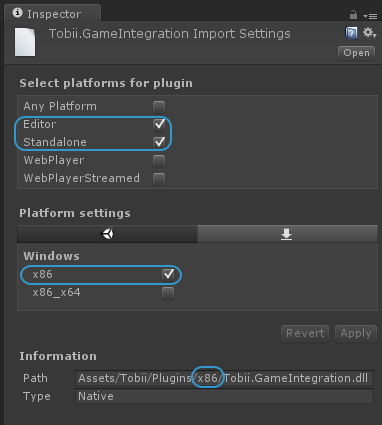
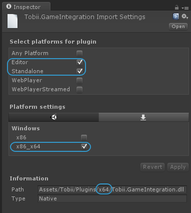
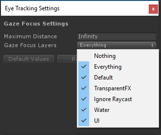

# Troubleshooting

If things are not working as you expected, please check out the following small troubleshooting guides.

## Contents

- ["Tobii.GameIntegration.dll could not be loaded"](#tobiigameintegrationdll-could-not-be-loaded)
- ["Multiple plugins with the same name 'tobii.gameintegration'"](#multiple-plugins-with-the-same-name-tobiigameintegration)
- ["Tobii Unity SDK only supports building for Standalone build targets"](#tobii-unity-sdk-only-supports-building-for-standalone-build-targets)
- ["I get invalid data"](#i-get-invalid-data)
- ["My Gaze Aware objects are not reacting to eye-gaze"](#my-gaze-aware-objects-are-not-reacting-to-eye-gaze)
- ["The gaze points are offset to the upper-left"](#the-gaze-points-are-offset-to-the-upper-left)
- [None of the above items describes the issue I have](#none-of-the-above-items-describes-the-issue-i-have)

## "Tobii.GameIntegration.dll could not be loaded"

Here are some things to try. Please try them in order:

### 1. Build Settings: Standalone PC

Make sure your build setting is for Standalone PC (Windows x86 or x86_64)

### 2. Correct bitness of dll in root folder

Check the bitness for Windows selected in the build settings (x86 or x86_64). Go to File Explorer in Windows and manually copy the `Tobii.GameIntegration.dll` from the corresponding `Assets/Tobii/Plugins/x86` or `../x64` folder to the game project's root folder.

### 3. Dll platform settings

Locate the dll's in the Project window in the Unity Editor (`Assets/Tobii/Plugins/x86` or `../x64` folder). Click on a dll and look in the Inspector, in the section Platform Settings. Make sure the the correct bitness is checked in the Inspector: Windows x86 or x86_64.

  

[&uarr; Back to Top](#troubleshooting)

## "Multiple plugins with the same name 'tobii.gameintegration'"

See [3. Dll platform settings](#3-dll-platform-settings) above. You might need to uncheck `Any Platform` alternative in the `Select platforms for plugin` section, and only have the `Editor` and `Standalone` alternatives checked.

## "Tobii Unity SDK only supports building for Standalone build targets"

If you get the error message:
>"Tobii Unity SDK only supports building for Standalone build targets. Eye-gaze data is only available on the Windows platform. Change platform in build settings to make the Eye Tracking features work."

Check your build settings and make sure Platform is set to "PC, Mac & Linux Standalone". See also: [Set Windows as Target Platform](manual#set-windows-as-target-platform)

The Tobii Unity SDK only provides data on Windows 10/8.1/7, and only builds without errors for standalone platforms (Windows, Mac and Linux).

[&uarr; Back to Top](#troubleshooting)

## "I get invalid data"

Getting invalid eye-gaze data is _expected_ in the following situations:

- during game startup,
- at the first call for a value (for example first call to [TobiiAPI.GetGazePoint()](scripting-api#tobiiapigetgazepoint)),
- for a few frames following the first call to a value function,
- during game shutdown,
- on unsupported platforms (like Mac and Linux)
- when the Tobii Unity SDK framework is not getting any data from the eye tracker:
  - when the eye tracker is not connected
  - when the user has disabled eye tracking in the Tobii EyeTracking settings
  - when you are not looking at the screen
  - when your eyes are outside the so called track-box in front of the eye tracker (try moving your head closer/further away, vertically or horizontally until the eye tracker can track your eyes)

You have to take these expected cases of invalid gaze data into account in your game implementation.

[&uarr; Back to Top](#troubleshooting)

## "My Gaze Aware objects are not reacting to eye-gaze"

First of all, the Gaze Aware component only works with 3D game objects with a `UnityEngine.Collider`. If you have attached the component to a UI element on a Canvas, it will not work. If you have attached the Gaze Aware component to a 3D game object that has a Collider but it doesn't work, keep on reading.

The Gaze Focus algorithms only work when the Tobii EyeTracking Framework has access to valid Gaze Point data. See the previous section for situations when the Gaze Aware objects are not expected to react to eye-gaze (because there is no valid Gaze Point data available).

If none of the above situations apply, open the Eye Tracking Settings window:
`Edit` &rarr; `Eye Tracking Settings...`

Verify that the proper layers for your game are selected in the Gaze Focus Layers multi-selection dropdown. Only the selected layers will be considered in the Gaze Focus algorithms that calculate which Gaze Aware game object the user is looking at.

[&uarr; Back to Top](#troubleshooting)

## "The gaze points are offset to the upper-left"

If the gaze points are offset to the upper-left when running the game in the Unity Editor, and the offset increases the closer to the lower-right corner of your screen you are looking, then you probably have a DPI-problem. On Windows 10 this offset problem is more common since the screen DPI is automatically set to higher values for high-resolution monitors. Here are possible workarounds:

- Set the DPI scale for your monitor manually to a value of 125% or lower, or
- Build a standalone build and test the eye-tracking related features there, or
- Locate `Unity.exe` in File Explorer - a common place is `C:\Program Files\Unity\Editor`. Right click the exe and open Properties. On the Compatibility tab, Settings section, check the option `Disable display scaling on high DPI settings`. Note that this will cause the Unity Editor to be rendered at 100% size also on high resolution screens, resulting in smaller fonts and button sizes than you might want.

[&uarr; Back to Top](#troubleshooting)

## None of the above items describes the issue I have

If you cannot find the answer to your problems here, please check out our [Developer Forums (developer.tobii.com/community-forums/)](http://developer.tobii.com/community-forums/). Use the Search function on the Forum overview page to find existing answers, or post a new topic if your question has not been posted before.

[&uarr; Back to Top](#troubleshooting)